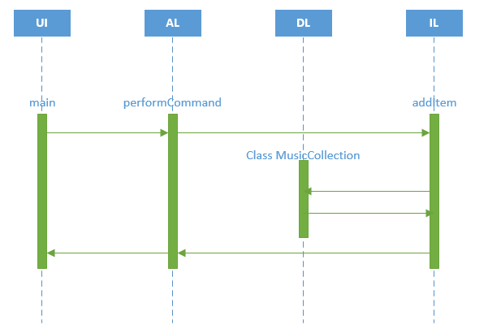

Министерство науки и высшего образования Российской Федерации  
Федеральное государственное бюджетное образовательное учреждение  
высшего образования  
«Кубанский государственный аграрный университет  
им. И.Т. Трубилина

ФАКУЛЬТЕТ ПРИКЛАДНОЙ ИНФОРМАТИКИ  
КАФЕДРА ИНФОРМАЦИОННЫХ СИСТЕМ

 

ОТЧЕТ  
к лабораторной работе №1  
по дисциплине "Современные технологии разработки  
программного обеспечения"  
Реализация приложения в многоуровневой архитектуре  
с использованием удалённого репозитория кода

 

Преподаватель: Петров А.А.

Студент группы: ПИ2041 Иваненко Кристина Михайловна

## Описание задания

Задача № 11: "Музыкальная коллекция".
Карточка "Музыкальный трек"
Карточка должна содержать следующие поля:
- Название трека
- Автор
- Исполнитель
- Длительность
- Оценка (от 0 до 5)

Вариант задания № 3: Постройте диаграмму последовательности выполнения команды add. Диаграмма должна показывать прохождение выполнения команды между программными объектами, расположенными в соответствующих слоях многоуровневой архитектуры.

## Адрес проекта

Проект хранится в удаленном репозитории по адресу: [https://github.com/KrisstinaIva/Lab_1](https://github.com/KrisstinaIva/Lab_1).

## Диаграммы классов

Диаграммы классов создаются автоматически при обновлении ветки `master` в удаленном репозитории GitLab и выкладываются в страницы проекта по адресу: [https://github.com/KrisstinaIva/Lab_1](https://github.com/KrisstinaIva/Lab_1).

## Диаграмма последовательности

Последовательность выполнения команды add:

Демонстрация работы команды add:

## Выводы

Изучены принципы рзработки приложния в многоуровневой архитектуре на языке С++ с использованием системы управления версиями git и удаленного репозитория github. На основе предоставленного шаблона решена задача "Музыкальная коллекция", позволяющая записывать информацию о песнях через добавление карточки "Музыкальный трек", поля карточки соответсвуют условиям задачи. На поля название трека, автор и исполнитель наложены ограничения по длине в 100 символов, на поле длительность наложено ограничение по длине в 5 символов, чтобы записать самую большую длительность 59:59, на поле оценка наложены ограничения значений в диапозоне от 0 и до 5.
